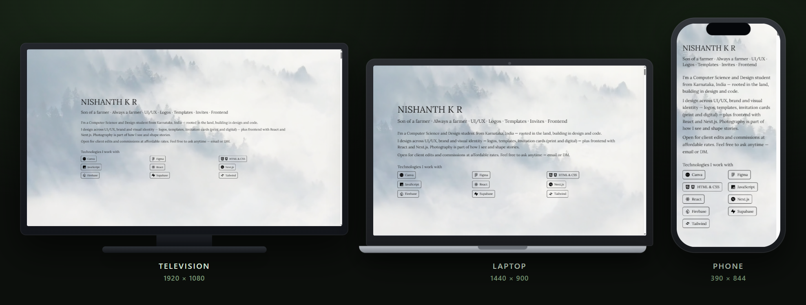
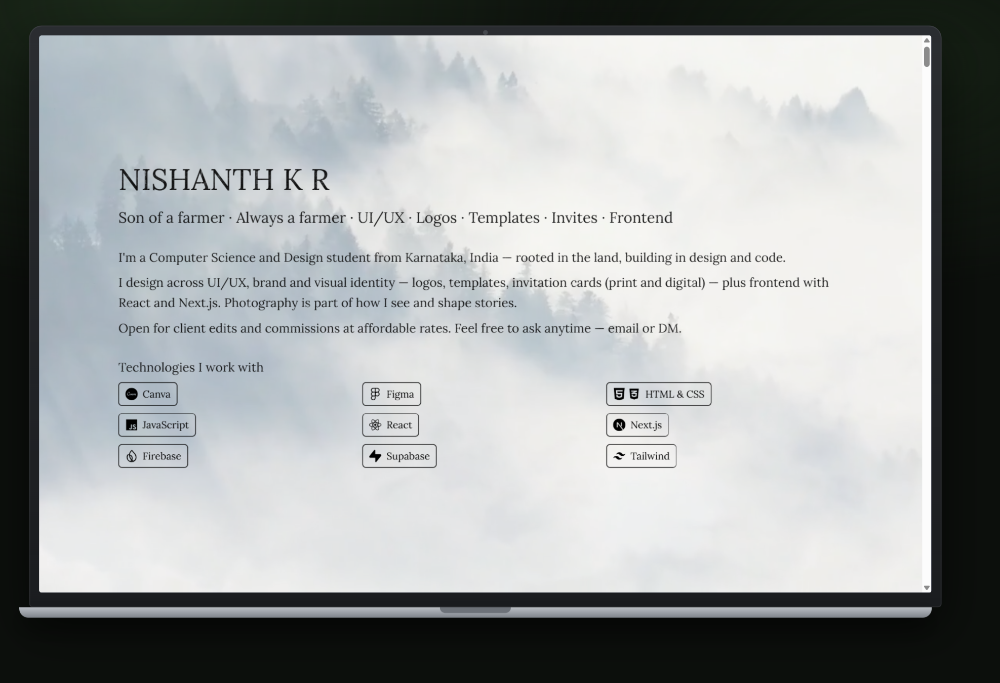
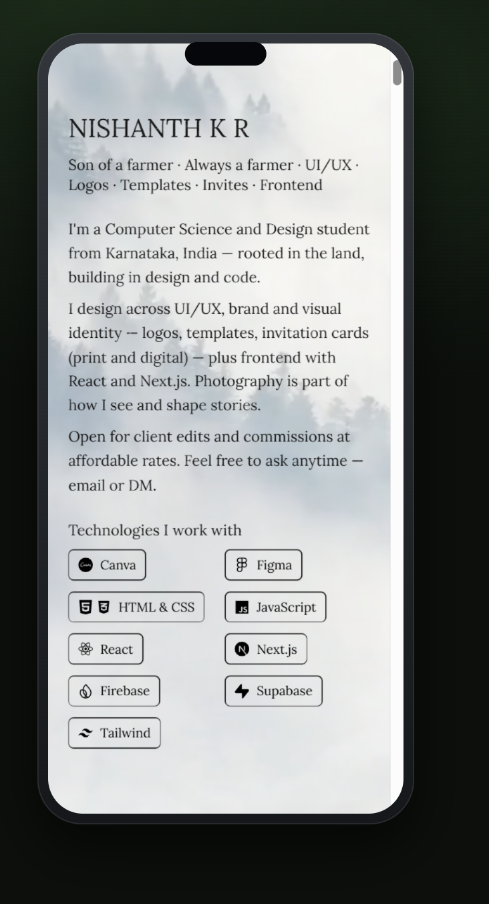
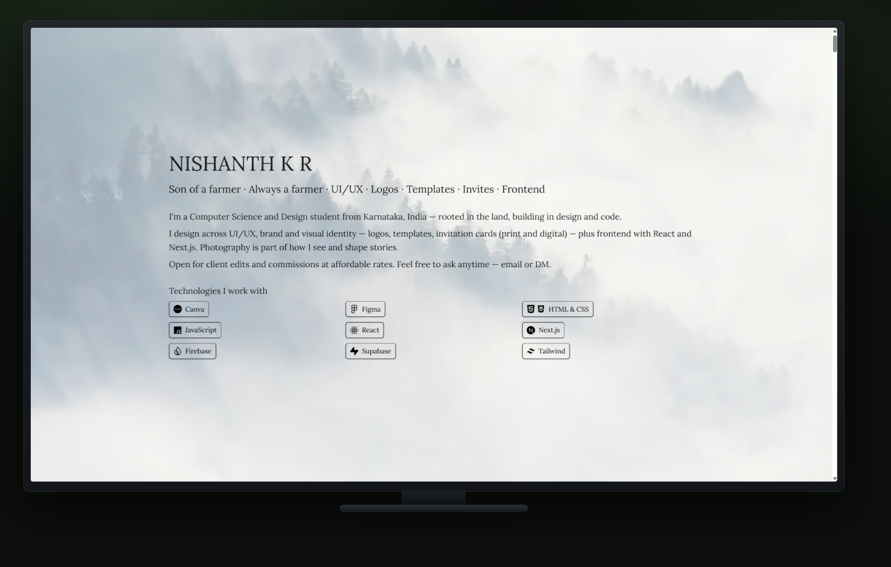
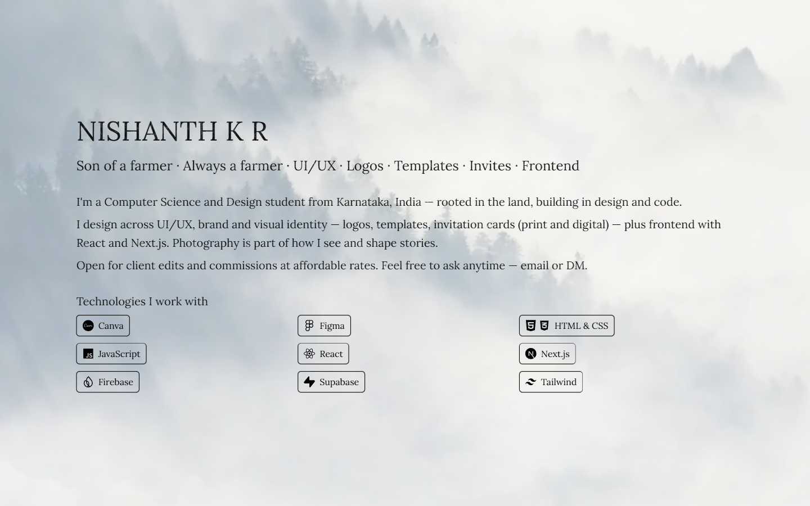
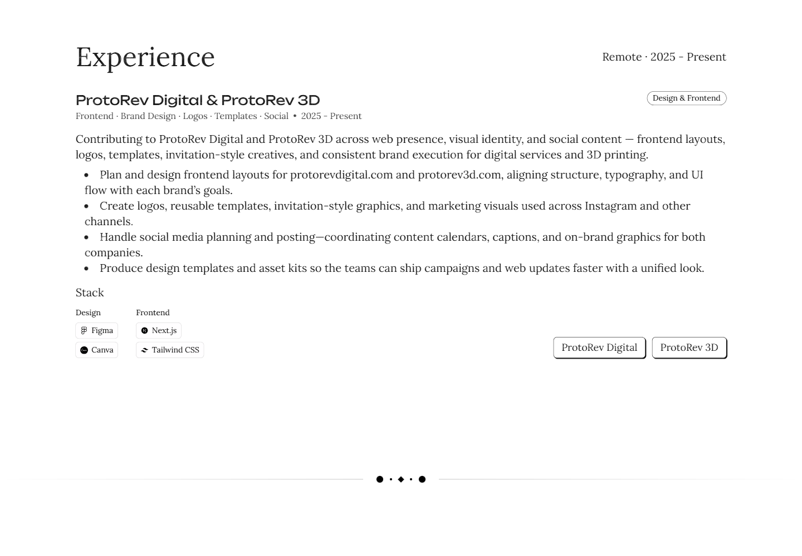
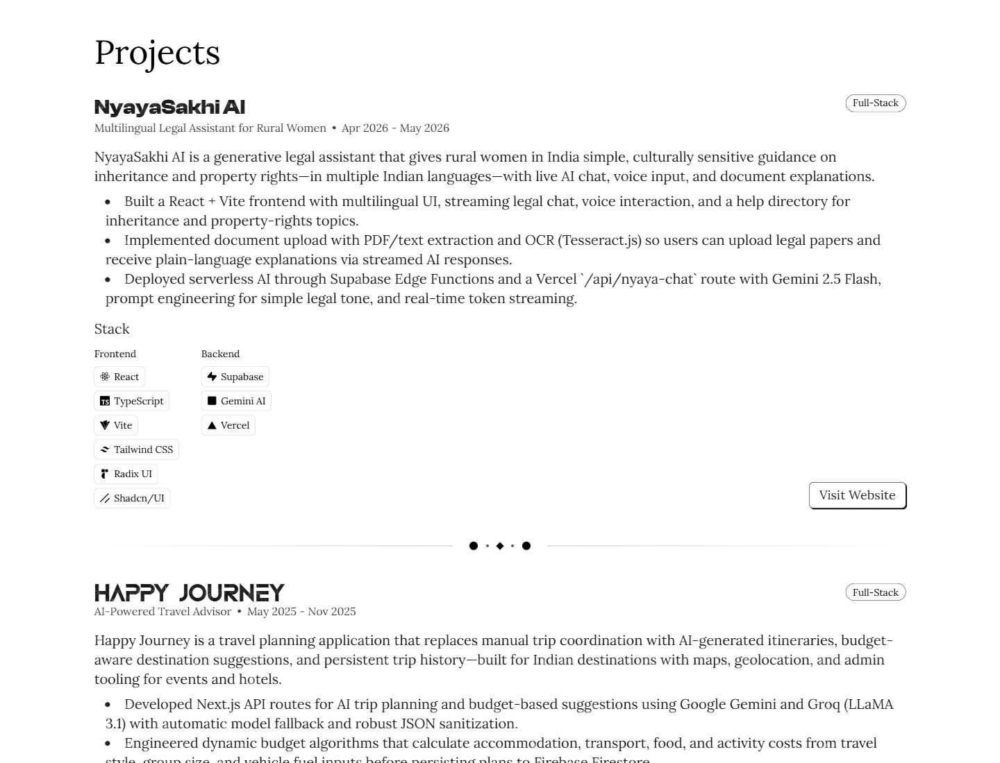
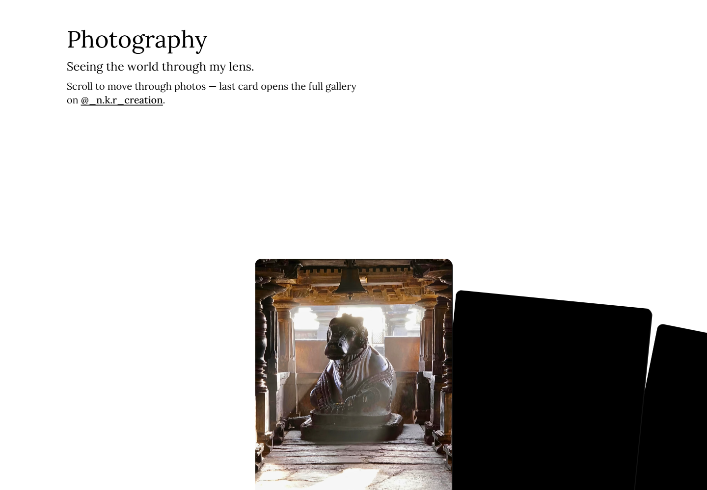
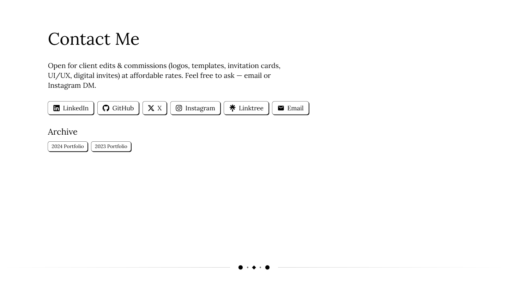

<div align="center">

# NKR · Portfolio — Nishanth K R

**Son of a farmer · Always a farmer · UI/UX · Logos · Templates · Invites · Frontend**

Official 2025 portfolio — design, frontend, photography, and client work.

Live: **[nkrportfolio.vercel.app](https://nkrportfolio.vercel.app/)**  
Archives: [/archive2024](https://nkrportfolio.vercel.app/archive2024) · [/archive2023](https://nkrportfolio.vercel.app/archive2023)

[](https://nextjs.org)
[](https://react.dev)
[](https://www.typescriptlang.org)
[](https://vercel.com)

</div>

<div align="center">
  
  <p><em>One portfolio · three displays — television, laptop, and phone.</em></p>
</div>

---

## Why this exists

A single place to see who I am and what I ship — UI/UX, logos, templates, invitation cards,
frontend with React / Next.js, and photography — with clear links to live work and archives.

> Rooted in the land. Building in design and code. Open for affordable client edits — email or DM anytime.

---

## What you'll find

- **Farmer-first identity** — the first line on the site is who I am.
- **Tech stack strip** — Canva, Figma, HTML/CSS, JS, React, Next.js, Firebase, Supabase, Tailwind.
- **Experience** — ProtoRev Digital & ProtoRev 3D (frontend, brand, logos, templates, social).
- **Projects** — live sites and GitHub repos with visit / repo links.
- **Photography** — visual stories from the field and beyond.
- **Templates & invites** — design work with Drive / gallery links.
- **Contact** — LinkedIn, GitHub, X, Instagram, Linktree, email.

---

## See it on every display

| Laptop · 1440 × 900 | Phone · 390 × 844 |
| :---: | :---: |
|  |  |

<div align="center">

### Television · 1920 × 1080



</div>

---

## Every section, one by one

### 1 · Hero & intro



### 2 · Experience



### 3 · Projects



### 4 · Photography



### 5 · Contact



---

## Tech stack

| Layer | Technology |
| --- | --- |
| Frontend | Next.js · React · TypeScript |
| Styling | Custom CSS / design system |
| Deploy | Vercel |

---

## Getting started (run it locally)

```bash
git clone https://github.com/Nishanth1409/Nkr.git
cd Nkr
npm install
npm run dev
```

Open **http://localhost:3000**.

| Command | What it does |
| --- | --- |
| `npm run dev` | Next.js development server |
| `npm run build` | Production build |
| `npm run start` | Serve production build |
| `npm run lint` | ESLint |
| `npm run format` | Prettier |

---

## Live & credits

| | |
| :--- | :--- |
| **Live** | [nkrportfolio.vercel.app](https://nkrportfolio.vercel.app/) |
| **Author** | [Nishanth K R](https://github.com/Nishanth1409) |
| **Portfolio** | [nkrportfolio.vercel.app](https://nkrportfolio.vercel.app) |

---

<div align="center">

*Son of a farmer · always a farmer.*

[GitHub](https://github.com/Nishanth1409) · [Portfolio](https://nkrportfolio.vercel.app)

</div>

